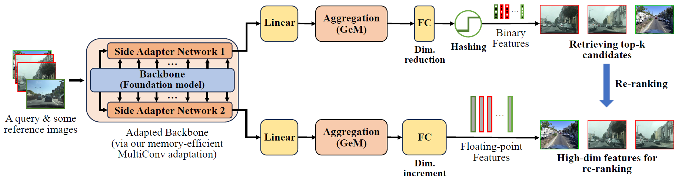

# SelaVPR++
This is the official repository for the IEEE T-PAMI 2025 paper "SelaVPR++: Towards Seamless Adaptation of Foundation Models for Efficient Place Recognition".

[[Paper on IEEE Xplore](https://ieeexplore.ieee.org/document/11229956) | [Paper on ArXiv](https://arxiv.org/pdf/2502.16601) | [Model on HF](https://huggingface.co/fenglu96/SelaVPRplusplus)]



The repository for the SelaVPR work (ICLR 2024) is [HERE](https://github.com/Lu-Feng/SelaVPR).

The repository for our another work ImAge (NeurIPS 2025) without aggregator is released at ​[HERE](https://github.com/Lu-Feng/ImAge).

To quickly use our SelaVPR++ model, you can use Torch Hub:

```
import torch
model = torch.hub.load('Lu-Feng/SelaVPRplusplus', 'SelaVPRplusplus', backbone='dinov2-large', aggregation='gem', hashing=True, rerank=True)
# model = torch.hub.load('Lu-Feng/SelaVPRplusplus', 'SelaVPRplusplus', backbone='dinov2-large', aggregation='gem', hashing=False, rerank=False)
# model = torch.hub.load('Lu-Feng/SelaVPRplusplus', 'SelaVPRplusplus', backbone='dinov2-base', aggregation='gem', hashing=True, rerank=True)
# model = torch.hub.load('Lu-Feng/SelaVPRplusplus', 'SelaVPRplusplus', backbone='dinov2-base', aggregation='gem', hashing=False, rerank=False)
```

## Getting Started

This repo follows the framework of [GSV-Cities](https://github.com/amaralibey/gsv-cities) for training, and the [Visual Geo-localization Benchmark](https://github.com/gmberton/deep-visual-geo-localization-benchmark) for evaluation. You can download the GSV-Cities datasets [HERE](https://www.kaggle.com/datasets/amaralibey/gsv-cities), and refer to [VPR-datasets-downloader](https://github.com/gmberton/VPR-datasets-downloader) to prepare test datasets.

The test dataset should be organized in a directory tree as such:

```
├── datasets_vg
    └── datasets
        └── pitts30k
            └── images
                ├── train
                │   ├── database
                │   └── queries
                ├── val
                │   ├── database
                │   └── queries
                └── test
                    ├── database
                    └── queries
```

Before training, you should download the pre-trained foundation model [DINOv2-base](https://dl.fbaipublicfiles.com/dinov2/dinov2_vitb14/dinov2_vitb14_pretrain.pth) and [DINOv2-large](https://dl.fbaipublicfiles.com/dinov2/dinov2_vitl14/dinov2_vitl14_pretrain.pth).

The MulConvAdapter is defined in `model/adapter.py` and called (for Memory-Efficient MultiConv Adaptation) in `model/vision_transformer.py`. The straight-through estimation (`class STE_binary`) for deep hashing is defined in `model/network.py`. The similarity-constrained loss (`loss2`) for deep hashing is written in `train_rerank.py`.

## Training

`--backbone` can be chosen as dinov2-base or dinov2-large; `--aggregation` can be chosen as gem, boq, or salad; `--training_dataset` can be chosen as gsv_cities or unified_dataset (See [Here](https://github.com/Tong-Jin01/Unified_dataset)).

### Training a single-branch standard VPR model (floating-point features)

```
python3 train.py --datasets_folder=/path/to/your/datasets_vg/datasets --dataset_name=pitts30k --backbone=dinov2-large --aggregation=gem --epochs_num=25 --lr=0.0004 --patience=12 --train_batch_size=120 --foundation_model_path=/path/to/pre-trained/dinov2_vitl14_pretrain.pth --training_dataset=gsv_cities
```

### Training a two-branch VPR model with global feature reranking (one hashing feature branch for fast retrieval, and the floating-point feature branch for reranking)

Please run this step after obtaining the standard VPR model, i.e., after running the previous step or directly downloading our trained standard VPR model.

```
python3 train_rerank.py --datasets_folder=/path/to/your/datasets_vg/datasets --dataset_name=pitts30k --backbone=dinov2-large --aggregation=gem --epochs_num=25 --lr=0.0004 --patience=12 --train_batch_size=120 --resume=/path/to/trained/model/SelaVPRplusplus_large.pth --training_dataset=gsv_cities --hashing --rerank
```

### Training a single-branch VPR model with hashing binary features

```
python3 train_hashing.py --datasets_folder=/path/to/your/datasets_vg/datasets --dataset_name=pitts30k --backbone=dinov2-large --aggregation=gem --epochs_num=25 --lr=0.0004 --patience=12 --train_batch_size=120 --foundation_model_path=/path/to/pre-trained/dinov2_vitl14_pretrain.pth --training_dataset=gsv_cities --hashing
```

## Test

### Test a single-branch standard VPR model (floating-point features)

```
python3 eval.py --datasets_folder=/path/to/your/datasets_vg/datasets --dataset_name=pitts30k --backbone=dinov2-large --aggregation=gem --resume=/path/to/trained/model/SelaVPRplusplus_large.pth
```

### Test a two-branch VPR model with global feature reranking (one hashing feature branch for fast retrieval, and the floating-point feature branch for reranking)

```
python3 eval_rerank.py --datasets_folder=/path/to/your/datasets_vg/datasets --dataset_name=pitts30k --backbone=dinov2-large --aggregation=gem --resume=/path/to/trained/model/SelaVPRplusplus_large_rerank.pth --hashing --rerank
```

### Test a single-branch VPR model with hashing binary features

```
python3 eval_hashing.py --datasets_folder=/path/to/your/datasets_vg/datasets --dataset_name=pitts30k --backbone=dinov2-large --aggregation=gem --resume=/path/to/trained/model/your_model.pth --hashing
```

## Pretrained models

All models are trained on our unified dataset.

<table style="margin: auto">
  <thead>
    <tr>
      <th>Retrieval</th>
      <th>Backbone</th>
      <th>Pitts30k</th>
      <th>MSLS-val</th>
      <th>Nordland</th>
      <th>Download</th>
    </tr>
  </thead>
  <tbody>
    <tr>
      <td>Standard VPR</td>
      <td>DINOv2-B</td>
      <td align="center">93.3</td>
      <td align="center">94.3</td>
      <td align="center">94.7</td>
      <td><a href="https://huggingface.co/fenglu96/SelaVPRplusplus/resolve/main/SelaVPRplusplus_base.pth">LINK</a></td>
    </tr>
    <tr>
      <td>Re-ranking (binary+float)</td>
      <td>DINOv2-B</td>
      <td align="center">93.3</td>
      <td align="center">94.5</td>
      <td align="center">94.6</td>
      <td><a href="https://huggingface.co/fenglu96/SelaVPRplusplus/resolve/main/SelaVPRplusplus_base_rerank.pth">LINK</a></td>
    </tr>
    <tr>
      <td>Standard VPR</td>
      <td>DINOv2-L</td>
      <td align="center">94.4</td>
      <td align="center">94.3</td>
      <td align="center">97.0</td>
      <td><a href="https://huggingface.co/fenglu96/SelaVPRplusplus/resolve/main/SelaVPRplusplus_large.pth">LINK</a></td>
    </tr>
    <tr>
      <td>Re-ranking (binary+float)</td>
      <td>DINOv2-L</td>
      <td align="center">94.4</td>
      <td align="center">94.5</td>
      <td align="center">97.2</td>
      <td><a href="https://huggingface.co/fenglu96/SelaVPRplusplus/resolve/main/SelaVPRplusplus_large_rerank.pth">LINK</a></td>
    </tr>
  </tbody>
</table>

## Acknowledgements

Parts of this repo are inspired by the following repositories:

[GSV-Cities](https://github.com/amaralibey/gsv-cities)

[Visual Geo-localization Benchmark](https://github.com/gmberton/deep-visual-geo-localization-benchmark)

[CosPlace](https://github.com/gmberton/CosPlace)

[DINOv2](https://github.com/facebookresearch/dinov2)

## Citation

If you find this repo useful for your research, please consider leaving a star⭐️ and citing the paper

```
@ARTICLE{selavprpp,
author={Lu, Feng and Jin, Tong and Lan, Xiangyuan and Zhang, Lijun and Liu, Yunpeng and Wang, Yaowei and Yuan, Chun},
  journal={IEEE Transactions on Pattern Analysis and Machine Intelligence}, 
  title={SelaVPR++: Towards Seamless Adaptation of Foundation Models for Efficient Place Recognition}, 
  year={2025},
  volume={},
  number={},
  pages={1-18},
  doi={10.1109/TPAMI.2025.3629287}}
```

```
@inproceedings{selavpr,
  title={Towards Seamless Adaptation of Pre-trained Models for Visual Place Recognition},
  author={Lu, Feng and Zhang, Lijun and Lan, Xiangyuan and Dong, Shuting and Wang, Yaowei and Yuan, Chun},
  booktitle={The Twelfth International Conference on Learning Representations},
  year={2024}
}
```
